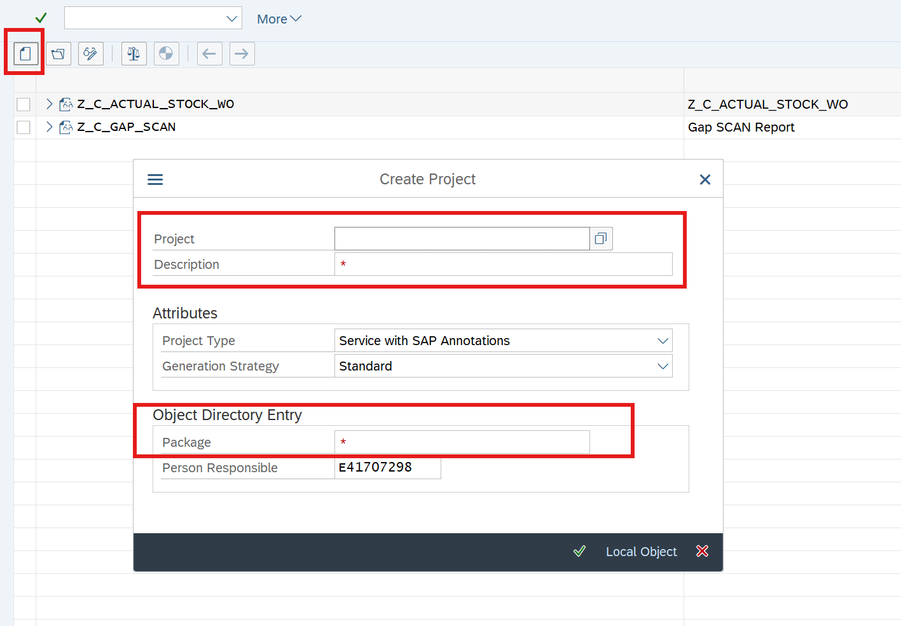

# Exercise 1: SEGW

## Overview

Creation SEGW(tcode) project. OData version 2.

  
🔵 Click to expand!

   
1. Create project (OData service). ZFIODEMO_SO_xx

    

  
🔵 Click to expand!

      
1. Registering service n/IWFND/MAINT_SERVICE 
2. Activating SICF 
3. Testing n/IWFND/GW_CLIENT 

  
🔵 Click to expand!

## Fiori elements feature map
https://blog.zeis.de/posts/2026-03-12-fiori-elements-feature-map/
      
1. MPC vs DPC classes 
2. CRUD operation 
3. Filtering 

