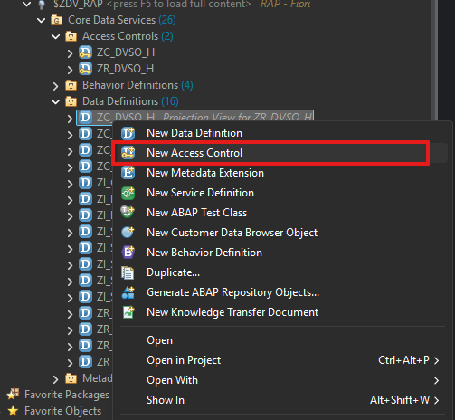
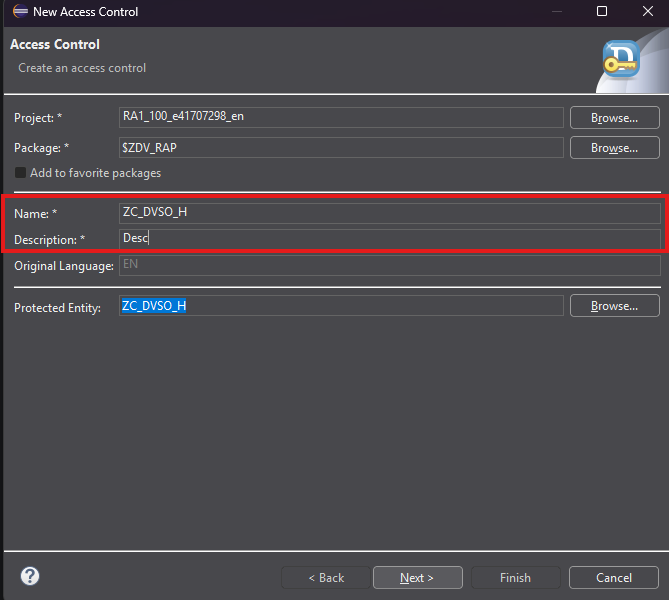
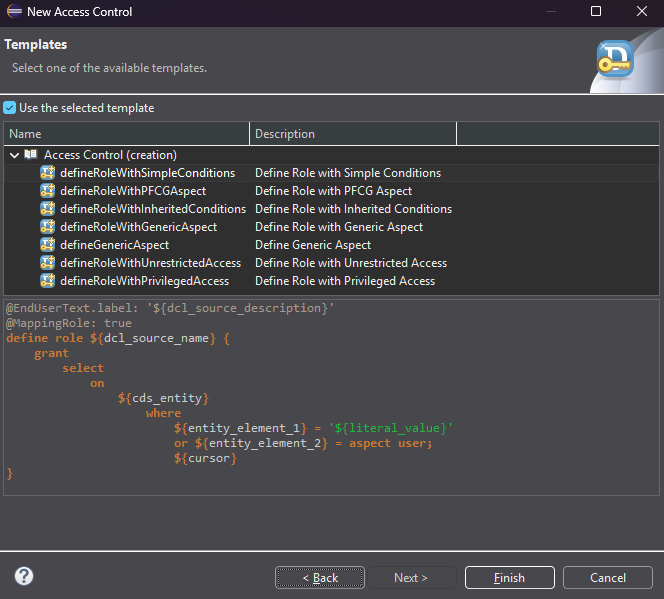

# HANDS-ON EXERCISE 5

## Introduction
In this hands-on exercise, you will create a Access control.

### Authorizations (DCL)

1. Right click on required Data Definition.  

   <!--     -->
    

2. Fill the required data.
 
   <!--     -->
    

3. Define transport request.

4. Define/Select template.

   <!--     -->
    

Access control artifacts included:
- Root DCL: [`ZR_DVSO_H.dcls`](../../source/ZR_DVSO_H-dcls.txt#L1-L6)
```ABAP
@EndUserText.label: 'ZR_DVSO_H'
@MappingRole: true
define role ZR_DVSO_H {
  grant select on ZR_DVSO_H
  where TRUE;
}
```
---
- Projection DCL: [`ZC_DVSO_H.dcls`](../../source/ZC_DVSO_H-dcls.txt#L1-L7)
```ABAP
@EndUserText.label: 'ZC_DVSO_H'
@MappingRole: true
define role ZC_DVSO_H {
  grant select on ZC_DVSO_H
  where INHERITING CONDITIONS FROM ENTITY ZR_DVSO_H REPLACING { ROOT WITH _BaseEntity };
}
```
---

> The root entity uses `authorization master (global)` and the handler provides a demo-friendly `GET_GLOBAL_AUTHORIZATIONS`.
