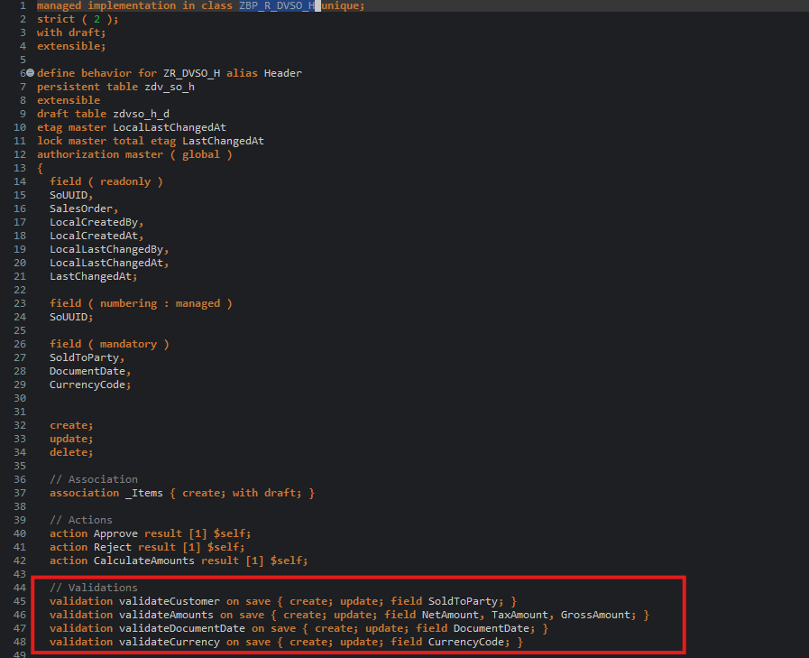
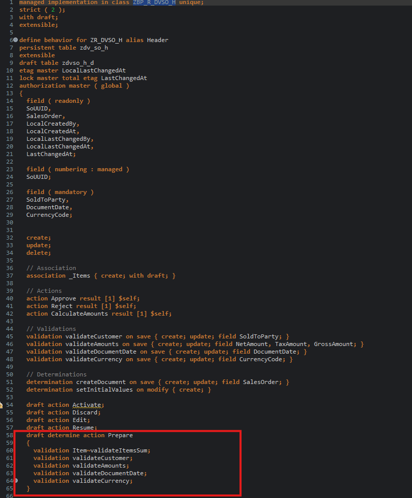

# HANDS-ON EXERCISE 8

## Introduction
In this hands-on exercise, you will handle a Validations.

### Validations on Save (Business Rules) ✅❌
Header validations (root behavior):
- `validateCustomer` (SoldToParty mandatory)
- `validateAmounts` (NetAmount > 0, TaxAmount >= 0)
- `validateDocumentDate` (mandatory and not in the future)
- `validateCurrency` (CurrencyCode mandatory)

Defined here:
- [`ZR_DVSO_H validations`](../../source/ZR_DVSO_H-bdef.txt#L43-L47)

1. Open your behavior definition  **`ZR_DVSO_H`**  

2. Because empty values will not be accepted for the fields **`SoldToParty`**, **`DocumentDate`**, and **`CurrencyCode`**, specify them as _mandatory_ field 
   by adding the following code snippet after the determination as shown on the screenshot below.
 
   <pre lang="ABAP">  
    field ( mandatory )
    SoldToParty,
    DocumentDate,
    CurrencyCode;  
   </pre>   

   Your source code should look like this:   

   <!--     -->
    

3. Define the validations **`validateCustomer`** and **`validateDates`**.
     
   For that, add the following code snippet after the determination as shown on the screenshot below.
   
   <pre lang="ABAP"> 
    validation validateCustomer on save { create; update; field SoldToParty; }
    validation validateAmounts on save { create; update; field NetAmount, TaxAmount, GrossAmount; }
    validation validateDocumentDate on save { create; update; field DocumentDate; }
    validation validateCurrency on save { create; update; field CurrencyCode; }
   </pre>          

4. In order to have draft instances being checked by validations and determinations being executed before they become active, they have to be specified for the **`draft determine action prepare`** in the behavior definition.
  
   Replace the code line **`draft determine action Prepare;`** with the following code snippet as shown on the screenshot below

   <pre lang="ABAP"> 
   draft determine action Prepare
   {
    validation Item~validateItemsSum;
    validation validateCustomer;
    validation validateAmounts;
    validation validateDocumentDate;
    validation validateCurrency;
   }
   </pre>     
     
   Your source code should look like this: 
   
   <!--  -->
          
     
   **Short explanation**:    
   - Validations are always invoked during the save and specified with the keyword `validateCustomer on save`.                
    
   **ℹ Hint**:    
   > In case a validation should be invoked at every change of the BO entity instance, then the trigger conditions `create`and `update` 
   > must be specified: e.g. `validation validateCustomer on save { create; update; }`
 
5. Save  and activate  the changes.
      
6. Add the appropriate **`FOR VALIDATE ON SAVE`** methods to the local handler class of the behavior pool of the _Travel_ BO entity via quick fix.  
   
   For that, set the cursor on one of the validation names and press **Ctrl+1** to open the **Quick Assist** view and select the entry _**`Add all <n> missing methods of entity ...`**_.
   
   As a result, the **`FOR VALIDATE ON SAVE`** methods **`validateCustomer`** and **`validateDates`** will be added to the local handler class `lcl_handler` of the behavior pool of the _Travel_ BO entity `ZBP_R_DVSO_H`.        

7. Save  and activate  the changes.

> Hint:  
> If you get an error message in the behavior implementation `The entity "ZR_DVSO_H" does not have a validation "VALIDATECUSTOMER".` try to activate the behvavior definition once again.

Item validation:
- `validateItemsSum on save { create; update; field NetAmount; }`
- Defined here: [`Item~validateItemsSum`](../../source/ZR_DVSO_H-bdef.txt#L122-L123)
- Orchestrated via draft prepare: [`Prepare triggers Item~validateItemsSum`](../../source/ZR_DVSO_H-bdef.txt#L59)

Implementation (draft-aware reads in LOCAL MODE + associations):
- [`validateItemsSum implementation`](../../source/ZBP_R_DVSO_H-clas.txt#L123-L177)

