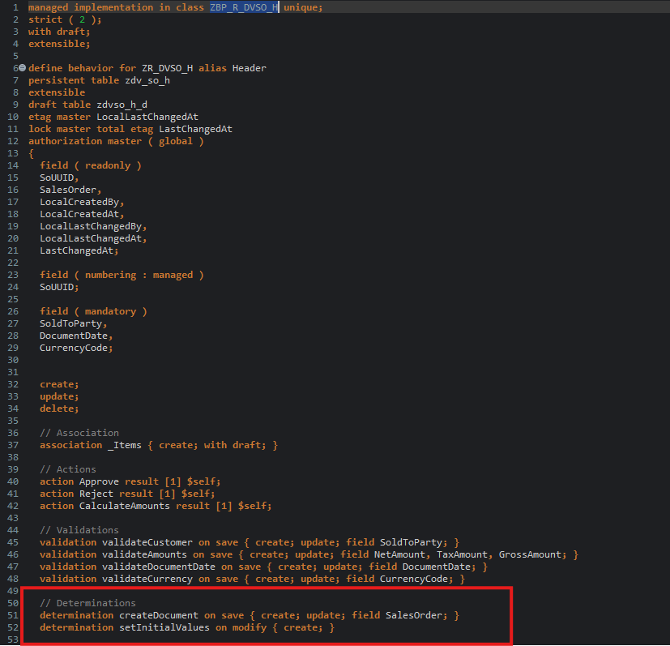

# HANDS-ON EXERCISE 9

## Introduction
In this hands-on exercise, you will handle a Determinations.

### About Determinations  
> A determination is an optional part of the business object behavior that modifies instances of business objects based on trigger conditions. A determination is implicitly invoked by the RAP framework if the trigger condition of the determination is fulfilled. Trigger conditions can be modify operations and modified fields.   
>  
> **Further reading**: [Determinations](https://help.sap.com/viewer/923180ddb98240829d935862025004d6/Cloud/en-US/6edb0438d3e14d18b3c403c406fbe209.html)

### Determinations (Auto-fill + consistency) 🧠
#### 1 SalesOrder generation (Header)
- Determination: `createDocument on save { create; update; field SalesOrder; }`
- Defined here: [`createDocument`](../../source/ZR_DVSO_H-bdef.txt#L50)
- Implemented here: [`createDocument implementation`](../../source/ZBP_R_DVSO_H-clas.txt#L282-L318)

1. Go to the behavior definiton of the BO entity **`ZR_DVSO_H`** and insert the following statement after the section **`delete;`** as shown on the screenshot below: 

   ```ABAP 
       determination createDocument on save { create; update; field SalesOrder; }
       determination setInitialValues on modify { create; }
   ```
   
   <!--  -->
    
   
   **Short explanation**:  
   The statement specifies the name of the new determination, `createDocument` and `on save` as the determination time when creating new instance (`{ create }`).
   
2. Save  and activate  the changes.   

3. Now, declare the required method in behavior implementation class with ADT Quick Fix.
  
   Set the cursor on the determination name **`createDocument`** and press **Ctrl+1** to open the **Quick Assist** view and select the entry _`Add method for determination createDocument of entity ...`_ in the view.
   
   As result, the `FOR DETERMINE` method **`createDocument`** will be added to the local handler class **`lcl_handler`** of the behavior pool of the BO entity **`ZBP_R_DVSO_H`**.
   
You are through with the definition of the determination.

#### 2 Default initialization (Header)
- Determination: `setInitialValues on modify { create; }`
- Defined here: [`setInitialValues`](../../source/ZR_DVSO_H.bdef.txt#L52)
- Implemented here: [`setInitialValues implementation`](../../source/ZBP_R_DVSO_H-clas.txt#L582-L604)

#### 3 Item numbering (Items)
Assigns incremental `ItemNo` (000010, 000020, …):
- Determination: `createItem on modify { create; field ItemNo; }`
- Defined here: [`Item~createItem`](../../source/ZR_DVSO_H.bdef.asbdef#L119)
- Implemented here: [`createItem implementation`](../../source/ZBP_R_DVSO_H-clas.txt#L16-L115)

#### 4 Item currency inheritance (Items) 💶
New items inherit `CurrencyCode` from the header (draft-aware, local mode):
- Determination: `getCurrency on modify { create; }`
- Defined here: [`Item~getCurrency`](../../source/ZR_DVSO_H.bdef.asbdef#L120)
- Implemented here: [`getCurrency implementation`](../../source/ZBP_R_DVSO_H-clas.txt#L182-L232)
