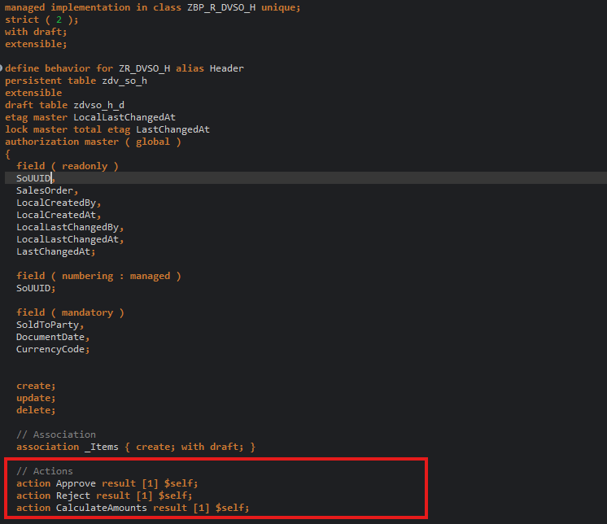
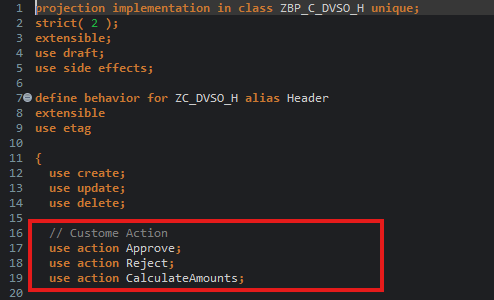

# HANDS-ON EXERCISE 10

## Introduction
In this hands-on exercise, you will handle a Actions.

### Information: Actions
> In the RAP context, an action is a non-standard operation that change the data of a BO instance. 
> 
> Actions are specified in behavior definitions and implemented in ABAP behavior pools. 
> By default, actions are related to instances of a BO entity. The addition `static` allows you to define a static actions that are not bound to any instance but relates to the complete entity.
> 
> Two main categories of actions can be implemented in RAP:  
> - **Non-factory actions**: Defines a RAP action which offers non-standard behavior. The custom logic must be implemented in the RAP handler method `FOR MODIFY`. An action per default relates to a RAP BO entity instance and changes the state of the instance.  An action is related to an instance by default. Non-factory actions can be instance-bound (default) or static.
> - **Factory actions**: Factory actions are used to create RAP BO entity instances. Factory actions can be instance-bound (default) or static. Instance-bound factory actions can copy specific values of an instance. Static factory actions can be used to create instances with prefilled default values.
>
> ℹ **Further reading**: [Actions](https://help.sap.com/viewer/923180ddb98240829d935862025004d6/Cloud/en-US/83bad707a5a241a2ae93953d81d17a6b.html) **|** [CDS BDL - non-standard operations](https://help.sap.com/doc/abapdocu_cp_index_htm/CLOUD/en-US/index.htm?file=abenbdl_nonstandard.htm) **|** [ABAP EML - response_param](https://help.sap.com/doc/abapdocu_cp_index_htm/CLOUD/en-US/index.htm?file=abapeml_response.htm)   
> ℹ **Further reading**: [RAP BO Contract](https://help.sap.com/docs/BTP/923180ddb98240829d935862025004d6/3a402c5cf6a74bc1a1de080b2a7c6978.html) **|** [RAP BO Provider API (derived types, %cid, implicit response parameters,...)](https://help.sap.com/docs/BTP/923180ddb98240829d935862025004d6/2a3da8a5b19e4f6b953e9a11fb5cc747.html?version=Cloud) 

### Instance Actions (Approve / Reject / CalculateAmounts) ⚡
Actions are defined on Header:
- **Approve** → sets `OverallStatus = 'A'`
- **Reject** → sets `OverallStatus = 'R'`
- **CalculateAmounts** → sets `GrossAmount = NetAmount + TaxAmount`

Defined here:
- [`Header actions`](../../source/ZR_DVSO_H-bdef.txt#L39-L41)

1. Go to your behavior definition **`ZR_DVSO_H`** and define the instance action without input paramater.
   
   For that, insert the following code snippet after the defined validations as shown on the screenshot below.
```
  action Approve result [1] $self;
  action Reject result [1] $self;
  action CalculateAmounts result [1] $self;
```
The result should look like this:   
   <!--   -->
   
   
   **Short explanation**:  
   - The name of the instance action is specified after the keyword **`action`**
   - The keyword **`result`** defines the output parameter of the action.
      - Its cardinality is specified between the square brackets (`[cardinality]`). It is a mandatory addition.  
      - **`$self`** specifies that the type of the result parameter is the same type as the entity for which the action or function is defined - i.e. the _Travel_ entity type in the present exercise. The return type of the result parameter can be an entity or a structure.     
    - **Note**: The output parameter **`result`** can be used to store the result of an action or function in an internal table. However, it does not affect the result of an action or function that is committed to the database.   
      
   > ℹ **Further reading**: [Action Definition](https://help.sap.com/viewer/923180ddb98240829d935862025004d6/Cloud/en-US/14ddc6b2442b4b97842af9158a1c9c44.html) 

2. Save  and activate  the changes.

3. Now, declare the required method in behavior implementation class with the ADT Quick Fix.

   Set the cursor on the action name, **`Approve/Reject/CalculateAmounts`**, and press **Ctrl+1** to open the **Quick Assist** view.
  
    Select the entry _**`Add methods for actions of entity ZR_DVSO_H`**_ in the view to add the required method to the local handler class.   
      
4. Save  the changes.

5. Set the cursor on the method name, **`Approve/Reject/CalculateAmounts`**, press **F3** to navigate to the declaration part of the local handler class of the behavior pool **`ZBP_R_DVSO_H`**.   

6. In the declaration part set the cursor on the method name, **`Approve/Reject/CalculateAmounts`**, press **F2**, and examine the full method interface.   
  
   **Short explanation**:  
   - The addition **`FOR MODIFY`** after the method name, together with the addition **`FOR ACTION`** after the importing parameter, indicates that this method provides the implementation of an action.
   - Method signature for the non-factory instance action `Approve/Reject/CalculateAmounts`:
     - `IMPORTING`parameter **`keys`** - a table containing the keys of the instances on which the action must be executed
     - Implicit `CHANGING` parameters (aka _implicit response parameters_):  
       - **`result`** - used to store the result of the performed action.
       - **`mapped`** - table providing the consumer with ID mapping information.
       - **`failed`** - table with information for identifying the data set where an error occurred.
       - **`reported`** - table with data for instance-specific messages.
      
    > 
  
    > **Please note**:  
    > An action is implemented in a **`FOR MODIFY`** method with the addition **`FOR ACTION`**. The signature of an action method always depends on the type of action: factory or non-factory, and instance or static.   
    > The rules for implementing an action operation in a RAP business object are explained in the respective _**Implementation Contract**_.      
    
    > ℹ **Further reading**: [Action Implementation](https://help.sap.com/viewer/923180ddb98240829d935862025004d6/Cloud/en-US/6edad7d113394602b4bfa37e07f37764.html)  **|**  [Implementation Contract: Action](https://help.sap.com/viewer/923180ddb98240829d935862025004d6/Cloud/en-US/de6569d4b92e40a0911c926170140beb.html)   
   
    Go ahead with the implementation of the action method.

Exposed in projection behavior (required for proper UI behavior):
- [`use action Approve/Reject/CalculateAmounts`](../../source/ZC_DVSO_H-bdef.txt#L16-L19)
```
  use action Approve;
  use action Reject;
  use action CalculateAmounts;
```

The result should look like this:   
   <!--   -->
   

Implemented here:
- [`Approve`](../../source/ZBP_R_DVSO_H-clas.txt#L320-L358)
- [`Reject`](../../source/ZBP_R_DVSO_H-clas.txt#L400-L438)
- [`CalculateAmounts`](../../source/ZBP_R_DVSO_H-clas.txt#L360-L398)

> [!IMPORTANT]
> For actions to appear as buttons in Fiori elements, you must also place them using UI annotations
> (e.g. `@UI.identification` / `@UI.lineItem` with `type: #FOR_ACTION`), typically in:
> - [`ZC_DVSO_H.ddlx`](../../source/ZC_DVSO_H-ddlx.txt#L76-L79)
