# HANDS-ON EXERCISE 12

## Introduction
In this hands-on exercise, you will create a Fiori Elements app in BAS.

### Generate Fiori Elements App (Optional)

Use:
SAP Business Application Studio
Visual Studio Code

Consume the OData V2/V4 services.

   <!-- 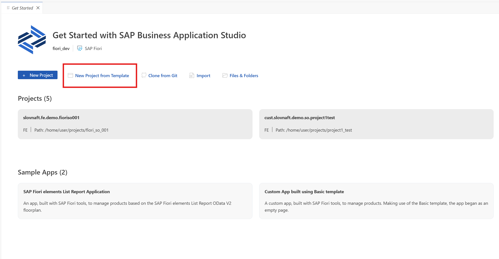  -->
   


   <!-- 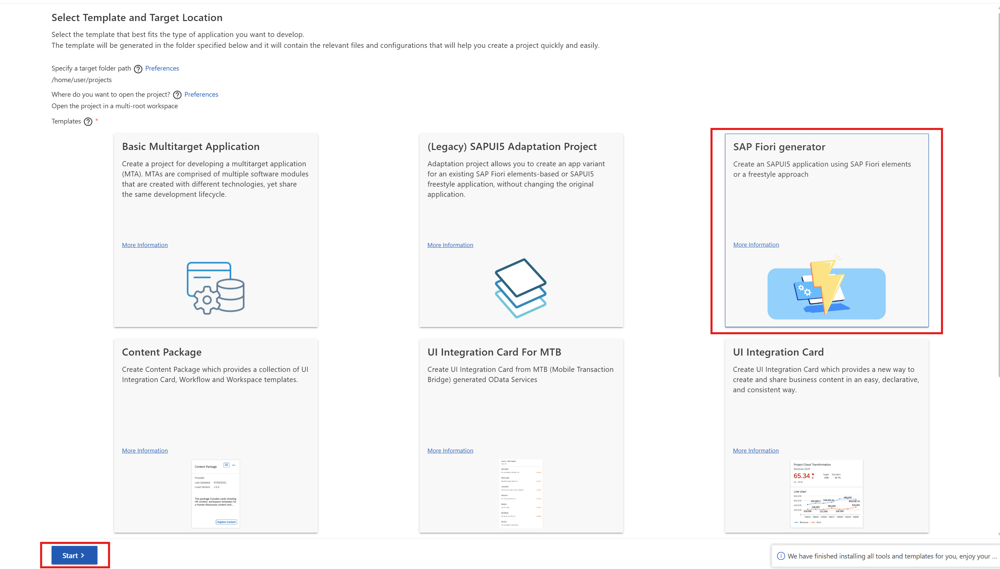  -->
   


   <!-- 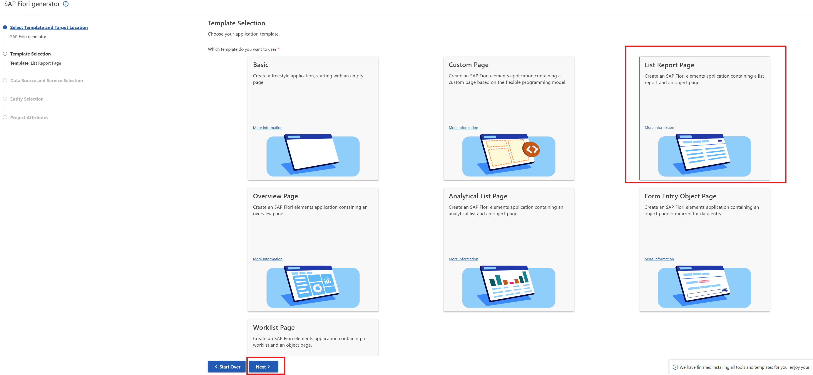  -->
   


   <!-- 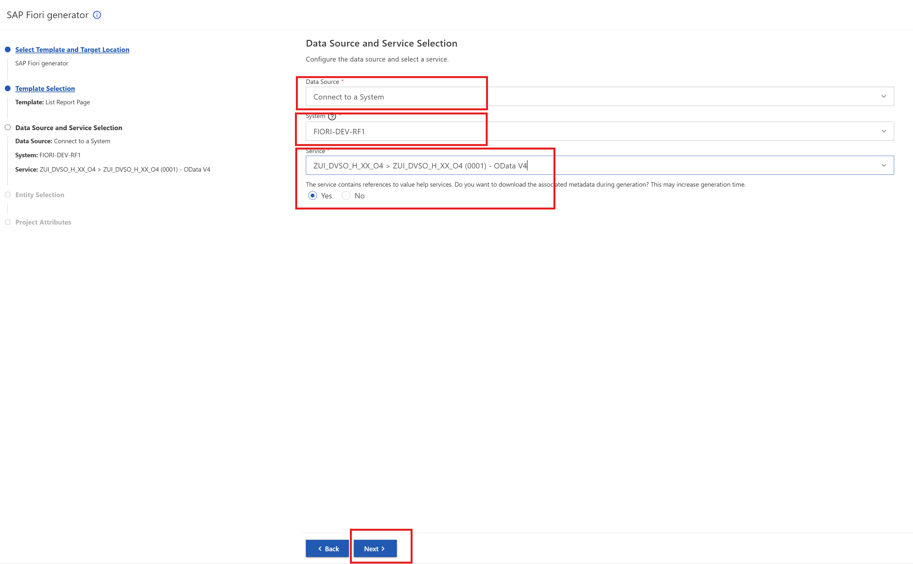  -->
   


   <!-- 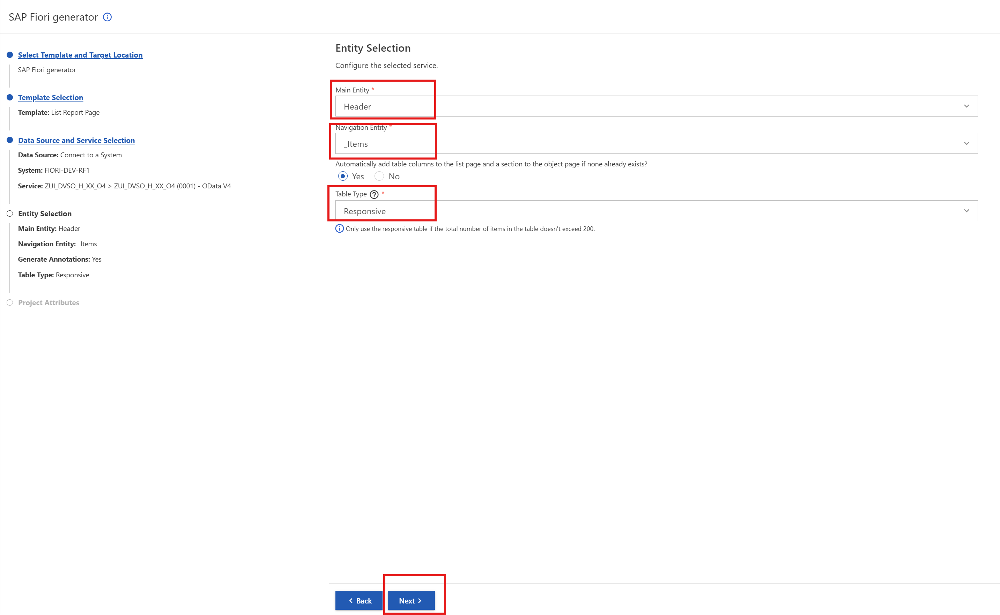  -->
   


   <!-- 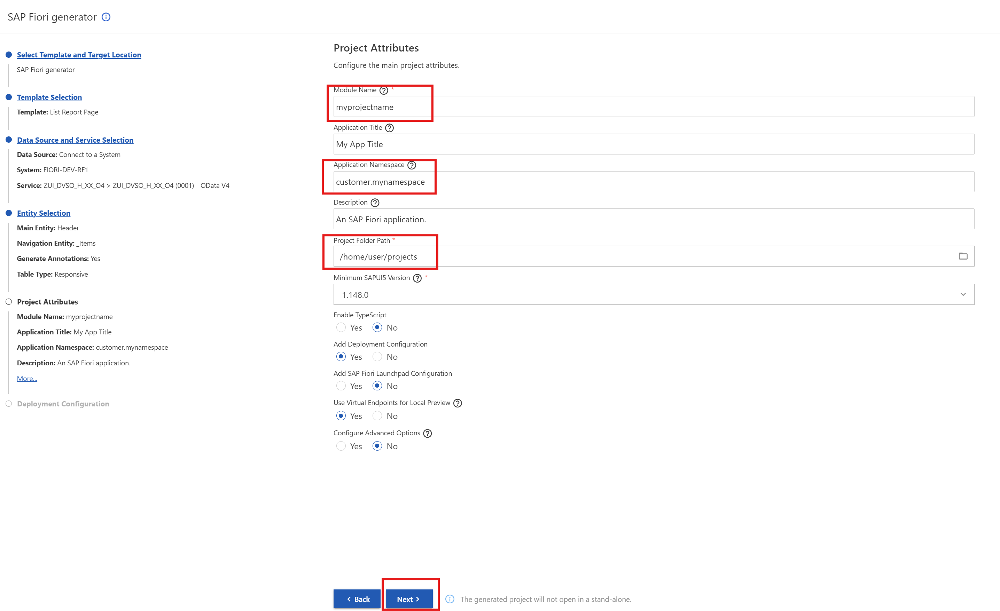  -->
   


   <!-- 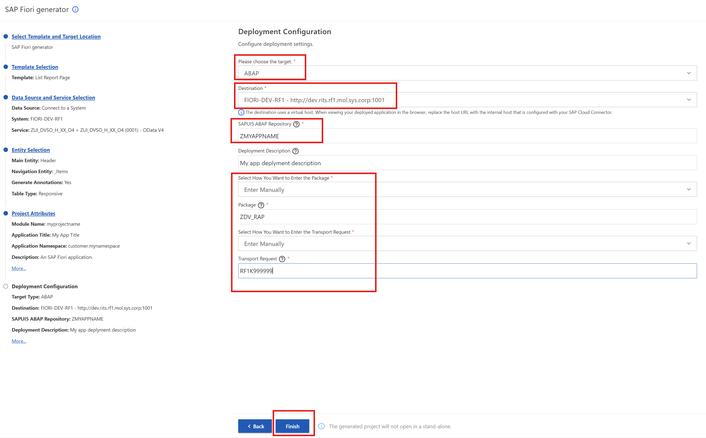  -->
   

### Run Fiori Elements App (Optional)

   <!-- 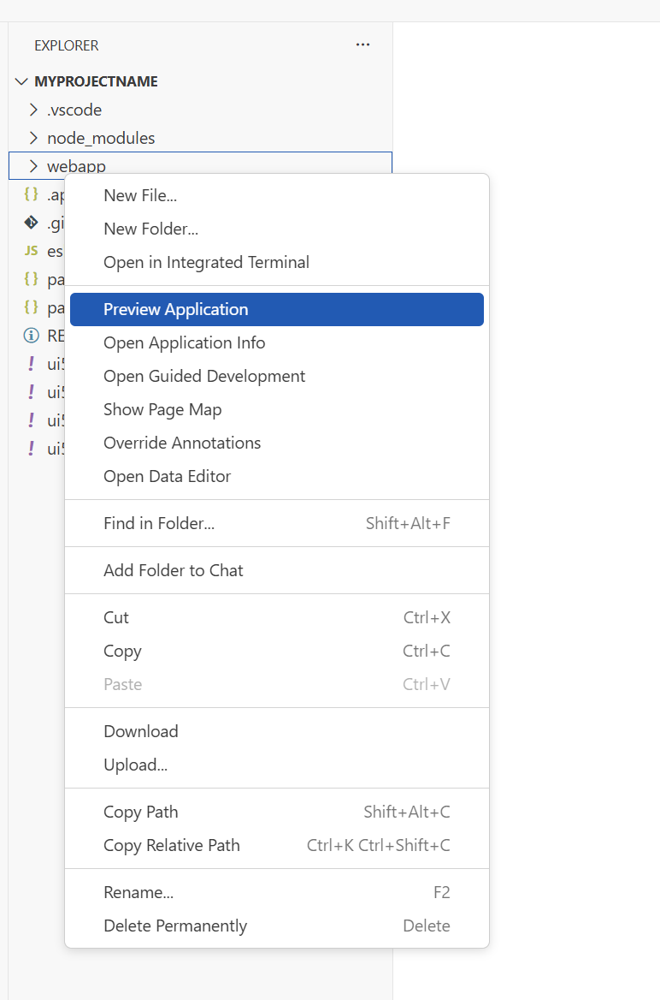  -->
   

   <!-- 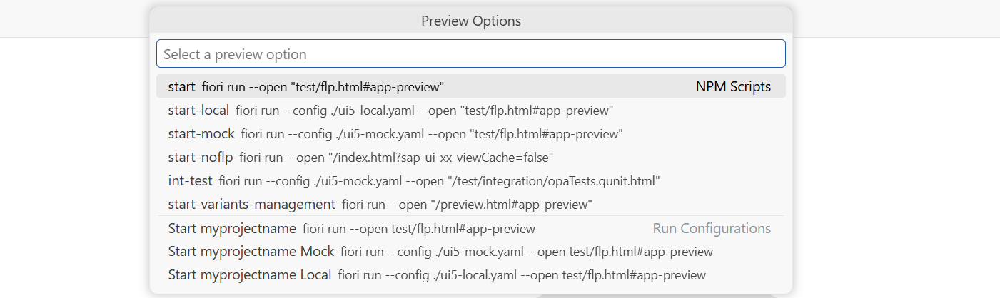  -->
   

   <!-- 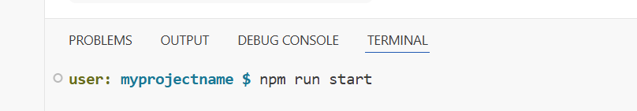  -->
   

```
npm run start
```

  
### Deploy Fiori Elements App (Optional)

   <!-- 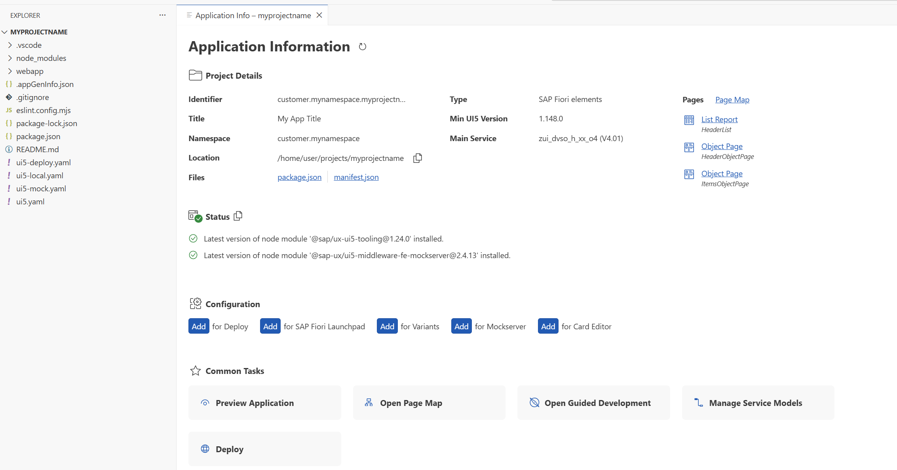  -->
   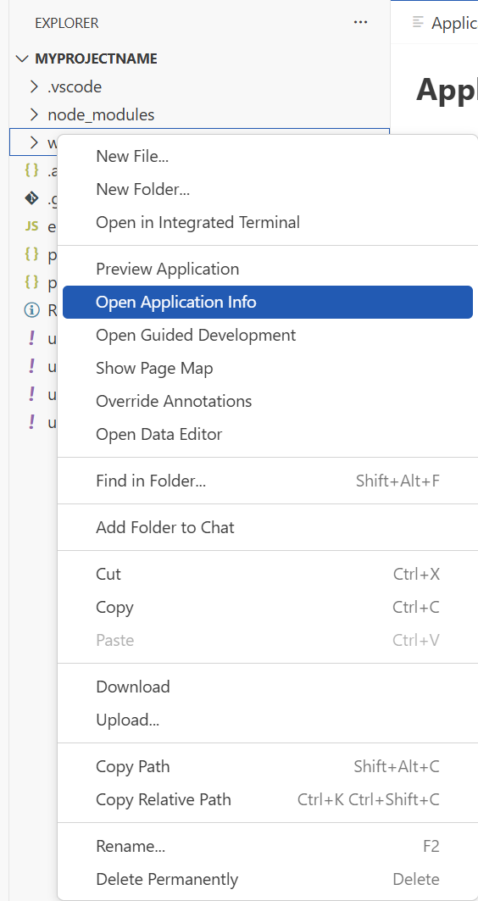

   <!--   -->
   


## 1. Open the terminal in BAS

In BAS:
```
Terminal → New Terminal
```
Go to your app folder if needed:
```
cd myprojectname
```
## 2. Install dependencies

Run:
```
npm install
```
This installs the deployment tooling from your package.json.

## 3. Verify deployment configuration

Check that your project contains:

 - ui5-deploy.yaml
 - package.json
 - webapp/

In package.json, you should typically see a deploy script like:
```
"scripts": {
  "build": "ui5 build --clean-dest",
  "deploy": "fiori deploy --config ui5-deploy.yaml"
}
```

## 4. Configure ui5-deploy.yaml

Example:
```
specVersion: "4.0"
metadata:
  name: customer.mynamespace.myprojectname
type: application
builder:
  resources:
    excludes:
      - /test/**
      - /localService/**
  customTasks:
    - name: deploy-to-abap
      afterTask: generateCachebusterInfo
      configuration:
        target:
          destination: FIORI-DEV-RF1
          url: http://dev.rits.rf1.mol.sys.corp:1001
          client: '100'
        app:
          name: ZMYAPPNAME
          description: My app deplyment description
          package: ZDV_RAP
          transport: RF1K999999
        exclude:
          - /test/
```
Key fields:

url → ABAP system URL
client → SAP client
name → BSP application name
package → ABAP package
transport → transport request

## 5. Add deployment tooling (if missing)

If fiori deploy is not available:
```
npm install --save-dev @sap/ux-ui5-tooling
npm install --save-dev @sap/ui5-builder-webide-extension
npm install --save-dev @ui5/cli
```
Sometimes also:
```
npm install --save-dev nwabap-ui5uploader
```

## 6. Build the app

Run:
```
npm run build
```
This creates the dist/ folder.

## 7. Deploy from terminal

Run:
   <!-- 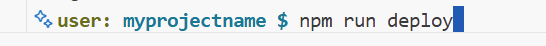  -->
   

```
npm run deploy
```
